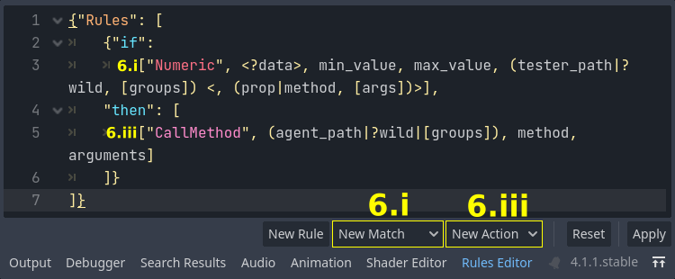

# Rule-Based Godot
A plugin for [Godot Engine 4.1+](https://godotengine.org/) that functions as a Rule-Based System framework. This was developed as the capstone project for my Computer Science bachelor degree at USP.

### Table of contents
1. [Installation](#instalation)
   1. [Using gd-plug](#using-gd-plug)
   2. [Directly from the Repository](#directly-from-the-repository)
2. [Adding rules to a scene](#adding-rules-to-a-scene)
   1. [Creating rules in the Inspector](#creating-rules-in-the-inspector)
   2. [Declaring rules in the RulesEditor](#declaring-rules-in-the-rules-editor)
3. [Resources](#resources)
   1. [Available](#available)
   2. [Creating new ones](#creating-new-ones)
4. [JSON syntax](#json-syntax)
   1. [How to read the syntax documentation](#how-to-read-the-syntax-documentation)
   2. [Syntax documentation](#syntax-documentation)

## Installation
### Using [gd-plug](https://github.com/imjp94/gd-plug)
Supposing the plugin manager is already installed (check its documentation for details), you need only to:
1. Add the `plug.gd` file below in the project root. If the file already exists, add the new line in the *_plugging()* function:
```gdscript
# plug.gd
extends "res://addons/gd−plug/plug.gd"

func _plugging():
	plug("rvbatt/rule−based−godot", {"include": ["addons/rule_based_godot/", "test_scenes/", "script_templates/"]})
```
2. Still on the project root, run the following command in the terminal:
```shell
godot −−no−window −s plug.gd install
```
3. On Godot's Editor, enter the Project menu, click in ProjectSettings, got to the Plugins tab and enable the **Rule-Based Godot** plugin.

|](screenshots/PluginEnabled.png "Plugins tab with Rule-Based Godot enabled")|
|:---:|
| Project > ProjectSettings > Plugins > Rule-Based Godot (Enable) |

### Directly from the Repository
1. Download or clone this repository. Use the last version on the [main](https://github.com/rvbatt/rule-based-godot/tree/main) branch. If you decide to download, the content will come in a _.zip_ file, so you will need to unpack it

2. Copy the `addons/rule-based-godot/` folder to your Godot's project root. If the _addons_ folder already exists, copy only the *rule_based_godot* subfolder and place it there
3. (Recommend) Copy the `test_scenes` and `script_templates` folders as well. If the _templates_ folder already exists, copy only its subfolders
4. Follow the same instructions given on the Step 3 of [Installation Using gd-plug](#using-gd-plug)

## Adding rules to a scene
1. Add a _RuleBasedSystem_ node to the scene
   > Recomendation: children of the _RuleBasedSystem_ will have a smaller relative path, so make the system node be the parent of the nodes you want to control
2. Set the type of _Iteration Update_ that the system will use:
   - `Every frame`: iterates every physics frame. **Use this with caution**, a
   large set of rules can take a while to run through
   - `On Timer`: iterates every _wait\_time_ seconds, which can be defined in the _Timer_ category on the Inspector
   - `On Call`: only iterates when the method _iterate()_ is called explicity. You can connect external signals to this method if you want to have a better control over it
3. Add an _Arbiter_. **Don't choose the _AbstractArbiter_**, because that's the abstract class and it doesn't implement the necessary function
   > Recomendation: save and `Quick Load` a resource file instead of creating a new arbiter

|](screenshots/AddingRules_Inspector_1to3.png "Inspector with basic RuleBasedSystem configuration")|
|:---:|
| Inspector after following steps 1 to 3 |

Now you can choose to use either the _Inspector_, with a graphical interface, or the _Rules Editor_ bottom panel, with a code driven approach, to declare the rules

### Creating rules in the Inspector
> Since the _RuleList_ and all of its components are resources, you can save and load any part of the data structure, sharing common rules, conditions or actions between several systems. The following steps talk about creating new ones from scratch, but you can skip any creation step if you load an existing resource instead.

4. Create a new _RuleList_ and start adding rules on the array, as many as you need
5. For each _Rule_, create its components (**never choose the ones that start with _Abstract_**):
   1. Create a _Condition_. If you choose a boolean match (NOT, OR, AND), you can then create its subconditions, repeating this step. If you choose a datum match,
   edit its properties, and don't forget to expand the groups to check them out
   2. Add an _Action_ to the array, then edit its properties, including the ones on
   the groups. You can repeat this step as many times as you want
6. (optional) Once you have defined the behavior you want, you can save a part or all of the list of rules as a resource file. You can save a _Condition_, an individual _Action_, a _Rule_ or the whole _RuleList_

> Obs.: You can give _Rules_, _Matches_ and _Actions_ a name, by editing the Name property on the Resource group (it's actually _resource_name_)

|](screenshots/AddingRules_Inspector_4to5.png "Inspector with rule declaration")|
|:---:|
| Inspector after following steps 4 and 5 |

### Declaring rules in the Rules Editor
> You can define rules in the **Rules Editor** bottom panel using a JSON syntax. The panel connects itself to the last _RuleBasedSystem_ that you've clicked, which will be the one showing on the Inspector.

4. Open the **Rules Editor** and use the `Reset` button if there is some leftover text in the editor

|](screenshots/AddingRules_Editor_4.png "RulesEditor default text")|
|:---:|
| RulesEditor after step 4 |

5. Add new rules using the `New Rule` button, as many as you need. **Be careful with the position of the cursor**, because the template will be inserted right at that position
6. For each rule, replace the *"condition"* and *"actions"* placeholders, using the corresponding buttons. Always be mindful of the cursor position
   1. Delete the *"condition"*, keep the cursor at that position and click the `New Match` button. Choose one of the options that popped up and click it. The format of the selected match will be inserted in the editor, where the cursor was
   2. Follow the syntax explained in the [documentation](#syntax-documentation) and replace the match's placeholders with the configuration you want. If you chose a boolean match, there will be another *"condition"* or *"conditions"*, so repeat the previous step
   3. Delete *"actions"* and click the `New action` button. Click one option. The JSON format of that type of action will be inserted where the cursor was
   4. Replace the action's placeholders with the action properties, following the [syntax](#syntax-documentation)
   5. Repeat steps **iii.** (without erasing the placeholder) and **iv.** to add more actions

|](screenshots/AddingRules_Editor_5to6.png "RulesEditor with match and action templates")|
|:---:|
| RulesEditor in the middle of step 6 |

7. When your rules are done, click the `Apply` button to set the current
_RuleBasedSystem_'s rule list. If the syntax is wrong, a JSON parsing error will appear and the *"apply"* will abort
8. (optional) Save the created text in a *.json* file in case you want to reuse some part later

|](screenshots/AddingRules_Editor_6to7.png "RulesEditor with rule declaration")|
|:---:|
| RulesEditor after steps 6 and 7 |

## Resources
### Available
| Type | Identifier | Description|
|:---:|---:|:---|
| Arbiters | FirstApplicable   | selects the first satisfied rule (assumes they are ordered by priority) |
|          | LeastRecentlyUsed | selects the satisfied rule that was triggered the longest time ago |
| Boolean Matches | NOT | logic gate |
|                 | AND | multiple-input logic gate |
|                 | OR  | multiple-input logic gate |
| Atomic Matches  | Numeric           | tests if a numeric value, obtained through a property or method call, is in an interval |
|                 | String            | tests if a string, obtained through a property or method call, is equal to a constant |
|                 | Hierarchy         | tests if two nodes have a certain relation: the first is *"Parent of"* the second, the first is *"Sibling of"* the second or the first is *"Child of"* the second |
|                 | Distance          | tests if the distance between the origin of two nodes is in an interval |
|                 | AreaDetection     | tests if there are objects (specific ones, or any) in an area |
|                 | DistinctVariables | applies a substitution that makes sure every listed variable has a distinct value |
| Actions | SetProperty | sets the property of a node |
|         | CallMethod  | calls the method of a node passing the arguments in a vector |
|         | EmitSignal  | adds a signal to a Node, if it doesn't have it, and emits it, passing the arguments in a vector |

### Creating new ones
To add new types of: **Arbiters**, **Boolean Matches**, **Atomic Matches** and/or **Actions**
1. Copy the [`script_templates`](https://github.com/rvbatt/rule-based-godot/tree/main/script_templates) folder to your Godot's project root. If this folder already exists, copy all of its subfolders
2. Create a new script and select the appropriate class to inherit from. Then, check the template box and select the *"New ___"*
   - Arbiter strategy: inherits from: `AbstractArbiter`
   - Multiple-entry Boolean Match: inherits from `AbstractBooleanMatch`
   - Atomic Match: inherits from `AbstractAtomicMatch`
   - Action command: inherits from `AbstractAction`

|](screenshots/ActionTemplate.png "Creating a New Action using the template")|
|:---:|
| Template option when creating a script |
3. Follow the instructions given on the template. For actions and matches, there are some flags that define which functions need to be implemented:
   - **Actions**:

   |Action Flag | Methods that **MUST** be implemented | Methods that *could* be overriden |
   |:---|:---|:---|
   | |`trigger(bindings)`| |
   | Agent Nodes |`trigger_node(agent_node, bindings)`|`get_agent_nodes(bindings)`|

   - **Atomic Matches**:

   |Atomic Match Flags | Methods that **MUST** be implemented | Methods that *could* be overriden |
   |:---|:---|:---|
   | |`is_satisfied(bindings)`| |
   | Tester Node |`node_satisfies_match(node, bindings)`|`get_candidates()`|
   | Tester Node, Data Based Node |`get_data(node)`, `data_satisfies_match(data)`|`get_candidates()`|
   | Tester Node, Data Based Node, Get Node Data Preset|`data_satisfies_match(data)`|get_candidates()|

## JSON syntax
### How to read the syntax documentation
- The term **condition** can be replaced by a _NOTMatch_, subtypes of _MultiBoolMatch_ or subtypes of _DatumMatch_.

- The **ID** of a component is its _class\_name_ without the "Action" or "Match" suffix.

Here are the patterns adopted to represent the syntax:

- `"constant"`: if something is between **" "**, then it is a constant and it should be written the exact same way, **including the quotation marks**
  > Ex.: _"Fixed"_ should be copied as _"Fixed"_ and not be replaced
- `?variable`: any name prefixed by an **?** represents a variable, or wild card. It can renamed to anything you want, but the string **must contain the question mark**
  > Ex.: _?data_ represents a variable named data, but it can be replaced by _?example_
- `[items]`: represents an array of arbitrary length, **including empty**, containing elements of type **item** separated by commas
  > Ex.: _\[fruits\]_ can be replaced by _\[\]_, _\[apple\]_ or _\[apple, banana, mango\]_
- `items...`: represents an arbitrary number (which **can be zero**) of elements of type **item** separated by commas, but not inside an array
  > Ex.: _colors..._ can be replaced by _red_ or _red, green, blue_ or by nothing
- `{keys: values}`: represents a dictionary where the keys have the type **key** and the values are of the type **value**, with arbitrary size, **including empty**
  > Ex.: _{characters: classes}_ can be replaced by _{}_ or by _{Alice: mage, Bob: fighter}_

  > **Note**: If the terms inside **{ }** are on the **singular** form (don't end with **s**), then the dictionary must contain only **one** entry
- `<optional>`: if something is between **< >**, you can choose to include it or not
  > Ex.: _\<adjective\>, noun_ can be replaced by _red, ball_ or just _ball_

  > **Note**: When used on **templates**, it indicates that the subtypes may or may not have this element
- `(choiceA|choiceB|choiceC.1, choiceC.2)`: you need to pick **one** of the choices
separated by **|** and between **( )**. One choice can have several items separated by commas
  > Ex.: _(melee\_weapon|ranged\_weapon, ammunition)_ can be replaced by _sword_ or by _bow, arrow_

### Syntax documentation

- **Rule List**: `{"Rules": [rules]}`
- **Rule**: `{"if": condition, "then": [actions]}`
- Matches:
   - **NOT**: `["NOT", condition]`
   - (Multiple-entry) Boolean template: _[ID, [conditions]]_
	    - **AND**: `["AND", [conditions]]`
	    - **OR**: `["OR", [conditions]]`
   - Atomic template: _[ID, <?data>, vars..., (tester_path|?wild, [groups]) <, (prop|method, [args])>]_
       - **DistinctVariables**: `["DistinctVariables", [distinct_variables]]`
	    - **Area Detection**: `["AreaDetection", area_path, (tester_path|?wild, [groups])]`
          > Obs: _area\_path_ must be the path to either an _Area2D_ or _Area3D_
	    - **Distance**: `["Distance", <?dist,> source_path, min_distance, max_distance, (tester_path|?wild, [groups])]`
          > Obs: _min\_distance_ e _max\_distance_ are float number, "inf" or "-inf"
	    - **Hierarchy**: `["Hierarchy", source_path, ("Parent of"|"Sibling of"|"Child of"), (tester_path|?wild, [groups])]`
	    - **Numeric**: `["Numeric", <?number,>  min_value, max_value, (tester_path|?wild, [groups]), (prop|method, [args])`
          > Obs: _min\_value_ e _max\_value_ are float number, "inf" or "-inf"
	    - **String**: `["String", <?string,> string_value, (tester_path|?wild, [groups]), (prop|method, [args])`
- Action template: _[ID, (agent_path|?wild|[groups]|), vars...]_
   - **Set Property**: `["SetProperty", (agent_path|?wild|[groups]|), {property: value}]`
     > Obs: _{property: value}_ only has only one entry
   - **Call Method**: `["CallMethod", (agent_path|?wild|[groups]|), method, [args]]`
   - **Emit Signal**: `["EmitSignal", (agent_path|?wild|[groups]|), signal <, {params: types}, [args]>]`
     > Obs: _{params: types}_ is a dictionary with the name of the signal parameters as keys and an arbitrary element with the same type as the corresponding argument as value. For example: _{number\_param: 1, string\_param: ""}_
